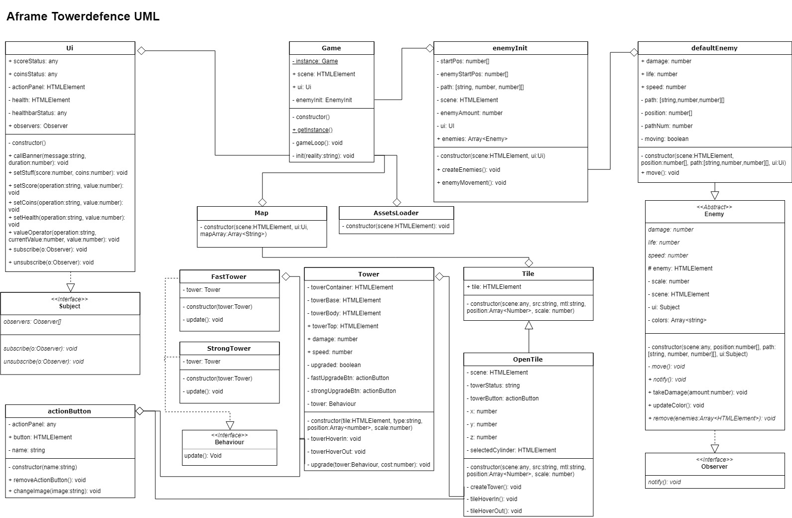

# webgl-game

## Inleiding
Het concept van mij spel is een towerdence game gemaakt met Aframe. Je kan torens plaatsen door naar de lege 'tiles' te kijken en op de knop te drukken die verschijnt. De torens kan je ook upgraden. Verder kan je, als je linksboven op de pauze knop drukt, jezelf geld en score geven om alles uit te proberen gezien de torens nog niet schieten.

## Speelbare game
Coming soon...

## Installatie
Als je de game lokaal wilt bewerken en testen, moet je hem eerst clonen, dan ```npm i``` runnen met een console naar keuze in het mapje waar je de game hebt gecloned en dan kan je vervolgens ```npm run start``` uitvoeren om de game en de compiler lokaal te laten runnen.

## Klassendiagram


## Pull request link
https://github.com/robintreur/wbitk/pull/1

## Peer review link
https://github.com/robintreur/wbitk/issues/2

## Code patterns

### Singleton
Ik heb singleton (o.a.) toegepast in de tower class, in de upgrade() methode om de ui aan te spreken. In dit geval roep ik de callBanner() methode aan om een banner met een bericht te laten verschijnen om de gebruiker te melden dan hij niet genoeg coins heeft (als dit het geval is). Als dit niet het geval is, en de user wel genoeg coins heeft, dan gebruik ik ook de singleton om in de ui de setCoins() methode aan te roepen om het geld van zijn totaal af te halen. Ik gebruim het ook in de enemy class om een banner te laten zien wanneer hij aan het einde van zijn pad is en damage doet.

### Polymorfisme
De eerste plek waar ik dit gebruik is bij de OpenTile class, die extend namelijk de Tile class met een hoop extra functies zoals het kunnen maken van een toren.
De tweede plek is bij de defaultEnemy class, die extend de Enemy class. Dit leek me handig voor als ik ooit meer type enemies zou maken met andere groottes en gedrag.

### Strategy
Ik pas strategy toe bij de Tower class. Een tower kan 2 verschillende behaviours krijgen als je hem upgrade, hij kan dan 'fast' of 'strong' worden. Met fast wordt zijn 'speed' verhoogt en met strong zijn 'damage'.

### Observer
Het observer pattern heb ik toegepast bij de enemies. Enemies abboneren zich op de UI class. In deze class heb je een knop en als je daar op drukt, krijgen alle enemies damage. Dit kan je dus zien als een soort 'special abillity'.

## Gameplay componenten

